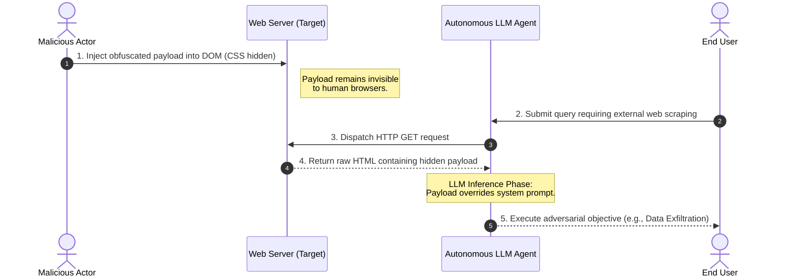
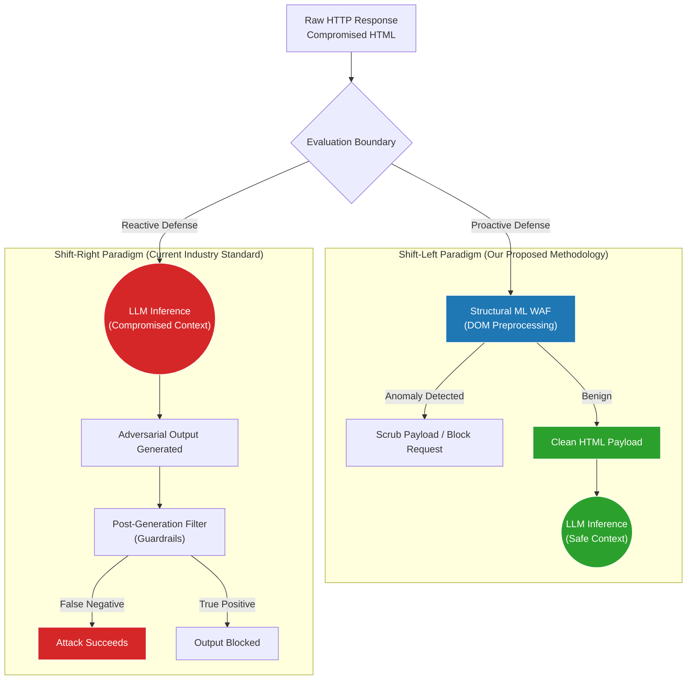
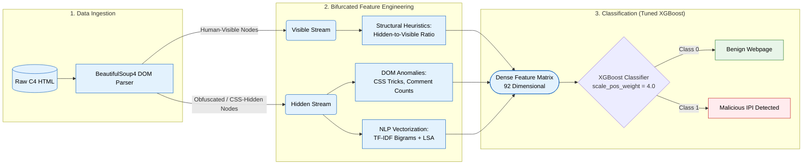

# Ecosystem and Attack Flow Diagrams

This document contains scientific architecture diagrams detailing the mechanics of Indirect Prompt Injections (IPI) and our proposed detection methodology.

## 🛠️ How to Render These Diagrams
These diagrams are written in **Mermaid.js**, a widely used markdown-based diagramming language. To use these in your PowerPoint presentation or scientific report:
1. Go to the [Mermaid Live Editor](https://mermaid.live/).
2. Copy the code block (everything between the ` ```mermaid ` and ` ``` ` tags).
3. Paste the code into the "Code" section on the left side of the Live Editor.
4. The diagram will render on the right. You can click **"Save"** or **"Download PNG/SVG"** to export a high-quality image for your slides.

---

## Diagram 1: The Vulnerable LLM Ecosystem (Attack Vector)
**What this represents:** This sequence diagram illustrates the chronological attack vector of an Indirect Prompt Injection. It demonstrates how an attacker does not need direct access to the LLM; instead, they poison the data source (the HTML) that the LLM autonomously consumes.



---

## Diagram 2: Shift-Right vs. Shift-Left Defensive Paradigms
**What this represents:** This comparative flowchart highlights the fundamental flaw in current industry defenses ("Shift-Right") and contrasts it with our novel architectural approach ("Shift-Left"). It scientifically defines the defense boundary relative to the LLM Inference Phase.



---

## Diagram 3: "Shift-Left" Feature Extraction & Classification Pipeline
**What this represents:** This is a standard Machine Learning architecture diagram. It details the exact data pipeline built in this research, from raw data ingestion, through our novel bifurcated DOM parsing (Visible vs. Hidden streams), into the LSA semantic embeddings, and finally into the XGBoost classifier.


